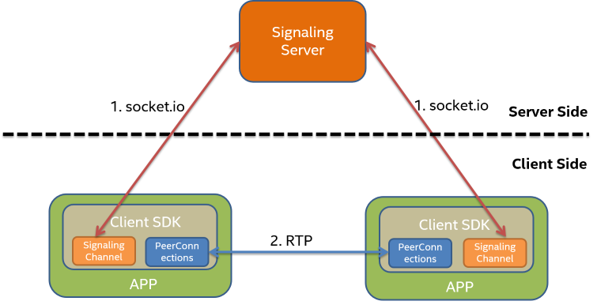

# Signaling Server Design

## Introduction

Signaling Server is used to exchange signaling messages between two OWT P2P clients. Client needs to connect to signaling Server first, so that it can send and receive signaling messages with remote endpoints.

P2P server in this repository is an implementation of signaling server, it works with default signaling channel in OWT client SDK samples. Signaling Server module can be customized and even be replaced by developers.

## Integration Use cases

There are two typical use cases to use P2P APIs of OWT SDKs.

- Using PeerServer and OWT's default Signaling channel(socket.io which is based on websocket and other transport protocols).
  In this use case, the developer uses both P2P APIs and signaling channel implemented with P2P server in this repository.
- Using P2P APIs with user' own message delivery method to replace OWT's default signaling Channel.
  In this use case, the developer doesn't deploy P2P Server and default signaling Channel. The developer only use P2P APIs to setup WebRTC connections, and  send signaling message with its own implementation of OWT signaling interface.

## Requirements

Signaling server needs to imlement following requirements:

- Delivery messages to destination in order and reliable.
- Know whether a user is online or not.

Message format is defined by signaling channel and signaling server's developer. P2P server in this repository use JSON as its format.

## P2P Server

### Overview

The diagram below shows the architecture of P2P Server in this repository.

It listens on 8095 port for plain http/ws connections, and 8096 for secure https/wss connections.

### Handshake

When a new client is connected, `authenticate` method will be called. We would like developers to integrate authentication with their account system, so currently P2P server just treat token as user name. No extra authentication procedure is performed. If the user name is already taken by another connection, the old connection will be disconnected.

P2P server also maintains a list of supported client versions. If a client with unsupported version is connected, it returns error code `2103`.

### Messaging

When a new message is received from client side, it checks whether the destination user is online. If destination user is offline, error code `2201` will be send to client side. Otherwise, the message will be deliveried to its destination.
